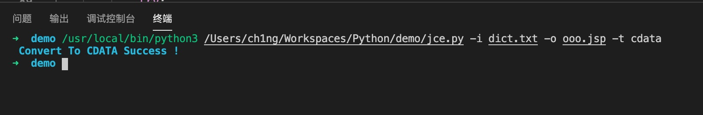

# JCE
JCE - JSP/JPSX CodeEncode - 用于 Webshell 逃避静态查杀的辅助脚本

# 简介
JCE 是一个用于 Webshell 逃避静态查杀的辅助脚本，可以将 JSP/JSPX 脚本编码成 HTML/Unicode/CDATA 内容格式。

# 测试环境
Apache Tomcat/8.0.30

# 使用

```
python3 jce.py -i infile.jsp -o outfile.jsp [-t](html/unicode/cdata)
```
原文件


运行


# 注意
如果出现了 HTTP Status 500 等一些报错，基本可以忽略，重新请求多几次即可
