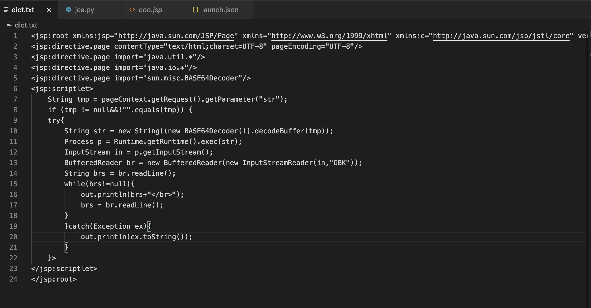
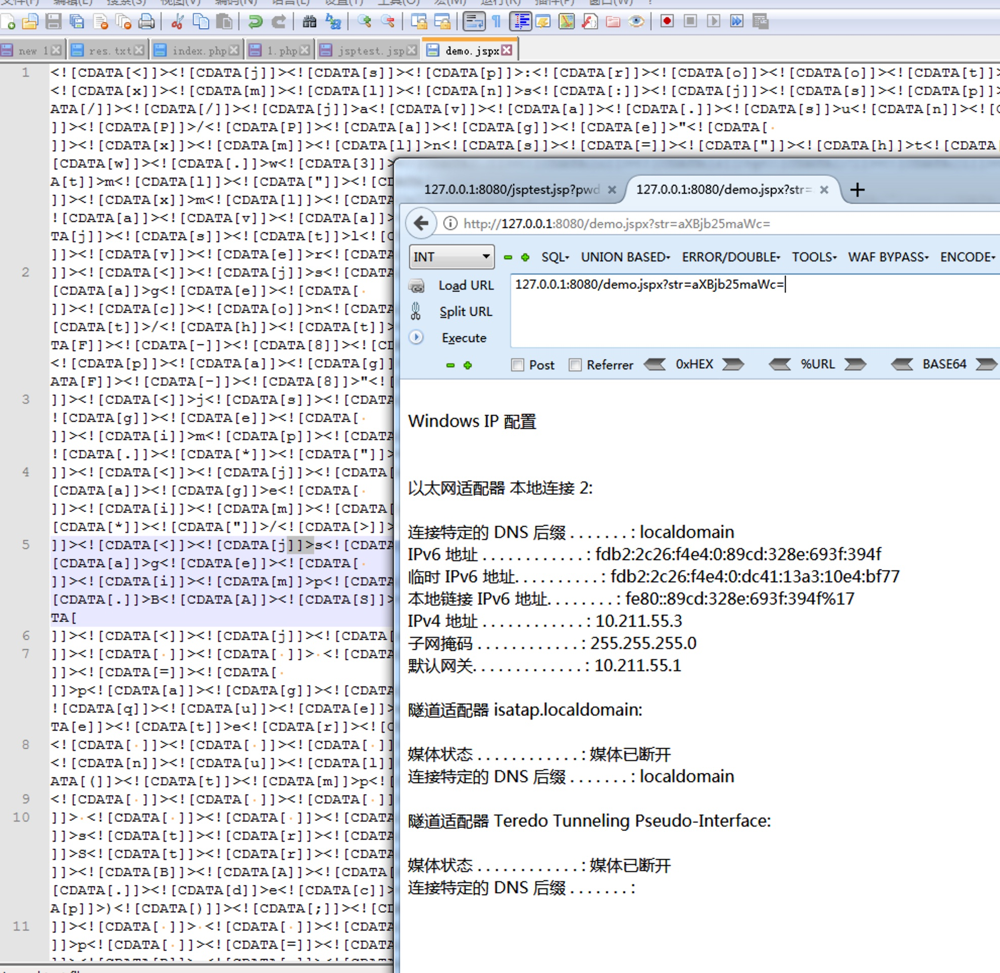

# JCE
JCE - JSP/JPSX CodeEncode - 用于 Webshell 逃避静态查杀的辅助脚本

# 简介
JCE 是一个用于 Webshell 逃避静态查杀的辅助脚本，可以将 JSP/JSPX 脚本编码成 HTML/Unicode/CDATA 内容格式。

# 更新
  - 增加 All 参数，选择该参数后三种编码随机交叉使用
  - 填坑，应该是最后一版了，修复若干 Bug，优化内部代码逻辑

# 测试环境
Apache Tomcat/8.0.30

# 使用

推荐编码
unicode > html = cdata = all

```
python3 jce.py -i infile.jsp -o outfile.jsp [-t](html/unicode/cdata/all)
```
原文件


编码后

# 注意
1. 原代码过长进行编码时候会出现了 HTTP Status 500 等一些报错，基本可以忽略，重新请求多几次即可
2. 推荐使用 unicode 进行编码
